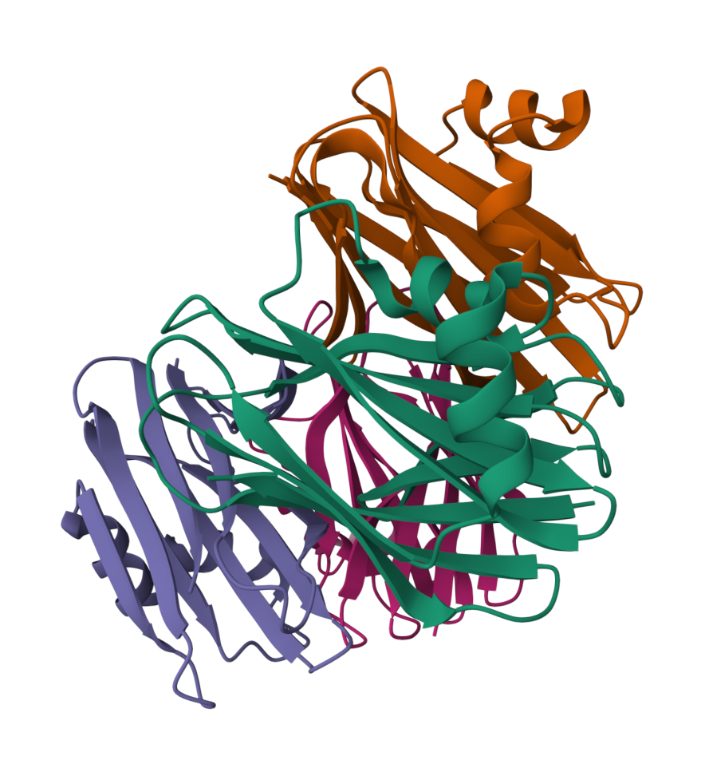
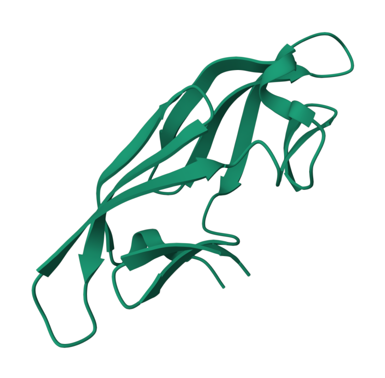
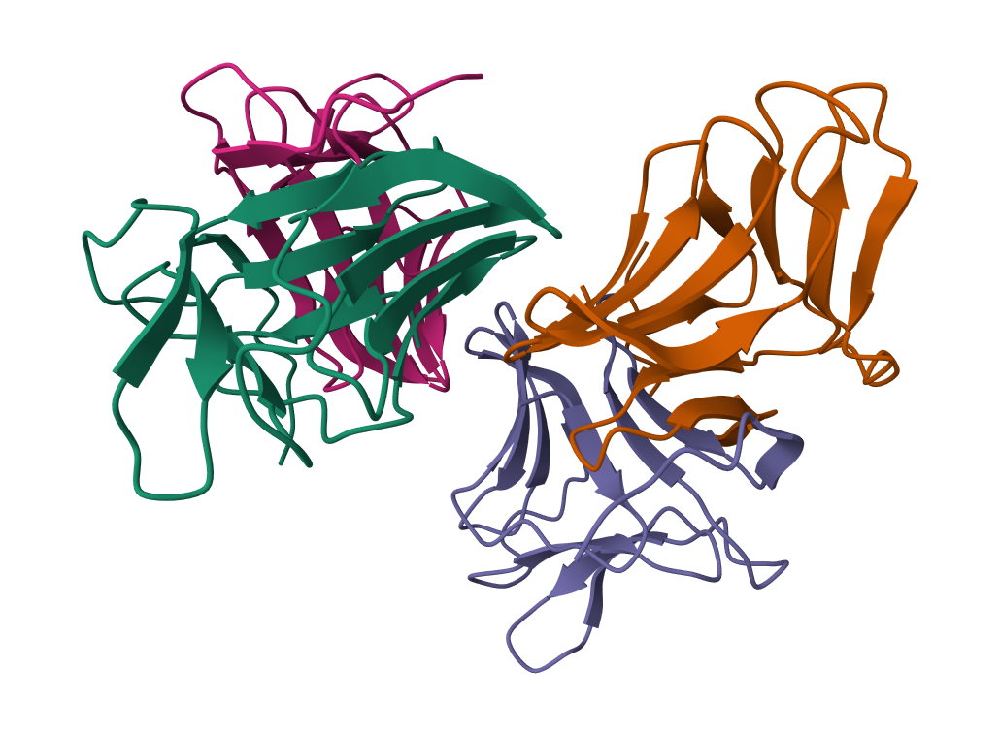
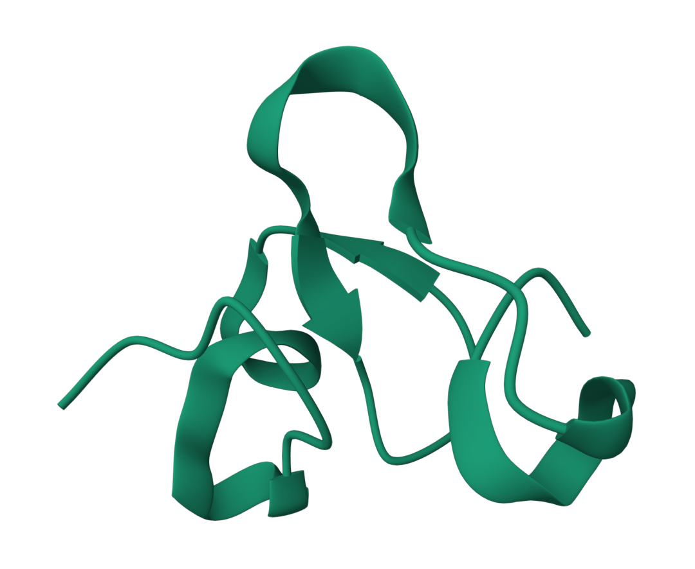
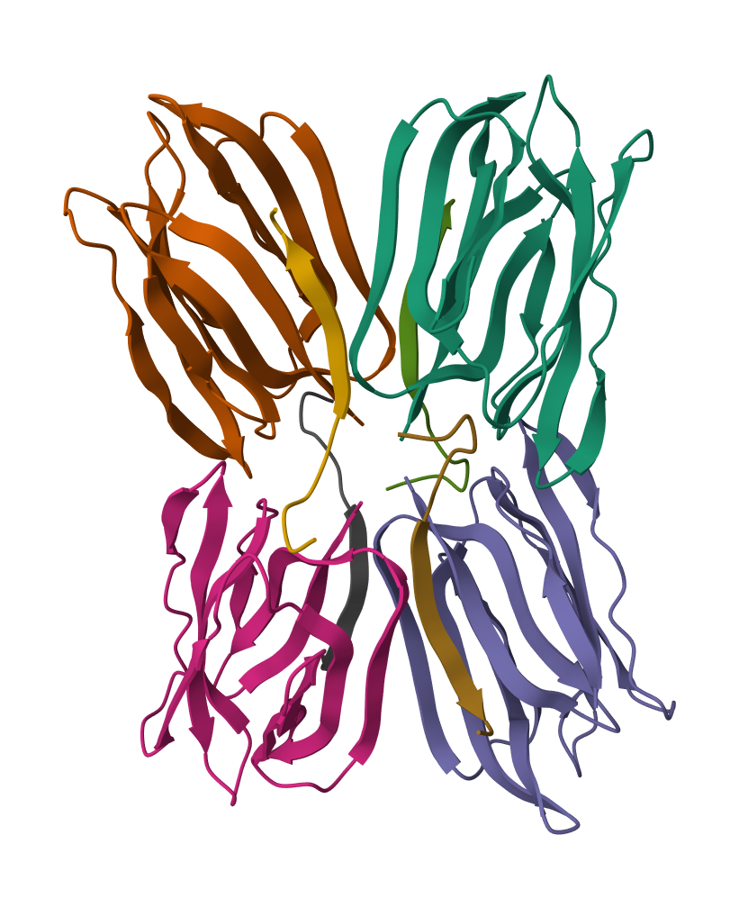
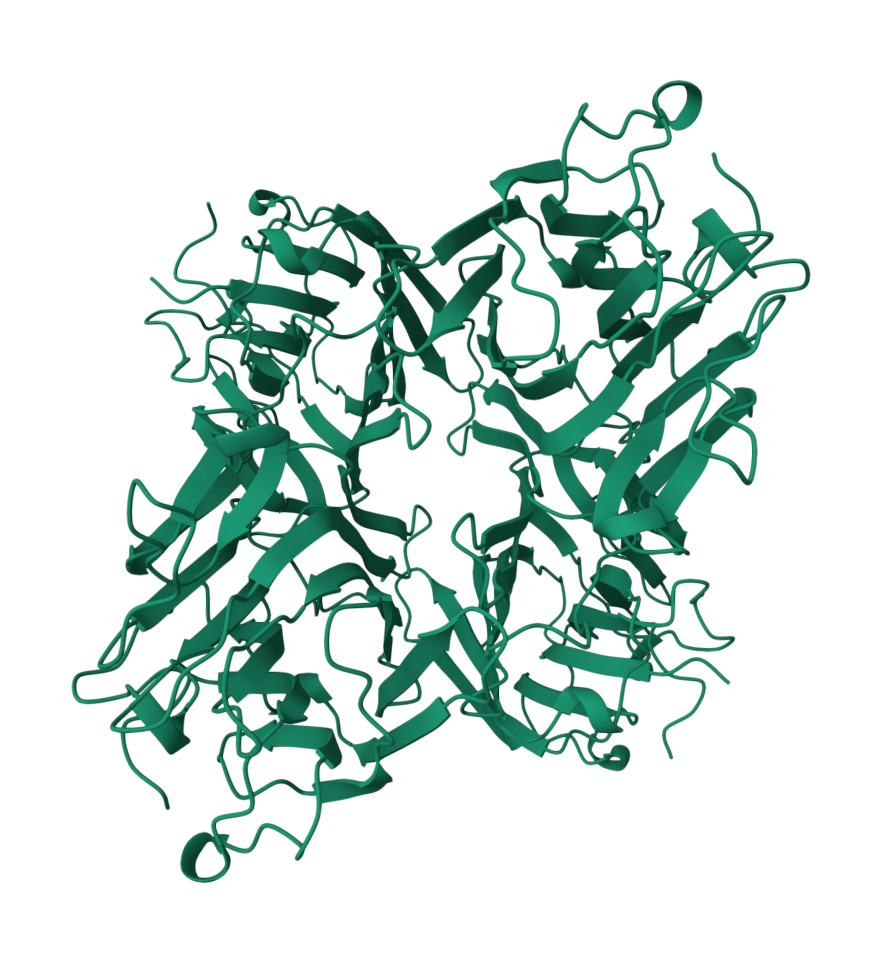
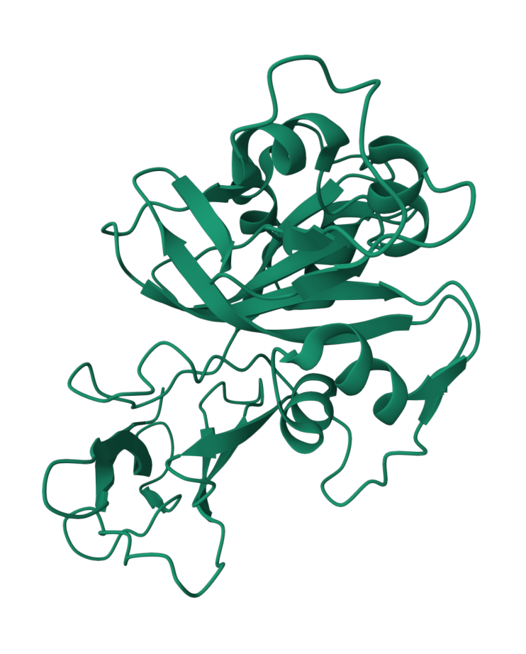
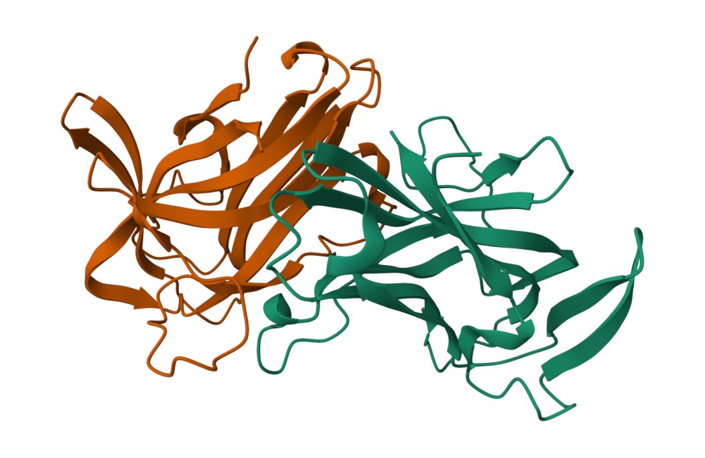
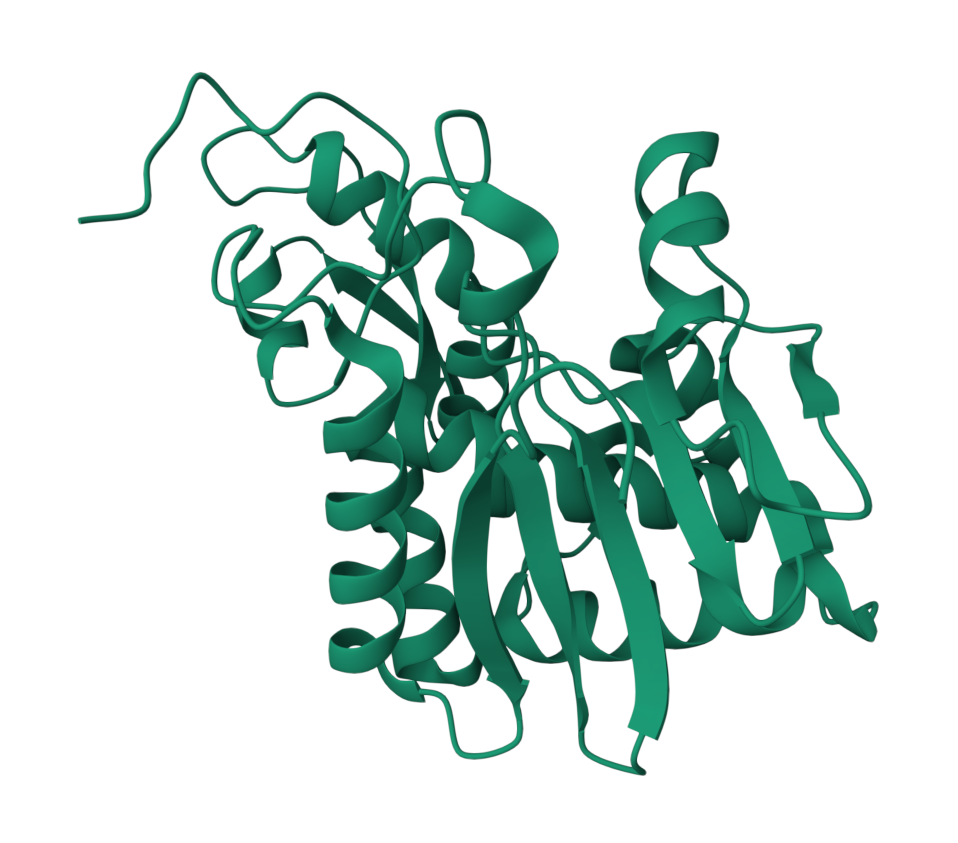

# Plant Lectin Families

Reference model sequences and conserved Pfam domains used for the identification of putative genes belonging to plant lectin families.

## Families

- [Agaricus bisporus lectin (ABA)](#agaricus-bisporus-lectin-aba)
- [Amaranthin](#amaranthin)
- [Chitinase related agglutinin (CRA)](#chitinase-related-agglutinin-cra)
- [Cyanovirin](#cyanovirin)
- [Euonymus europaeus lectin (EUL)](#euonymus-europaeus-lectin-eul)
- [Galanthus nivalis lectin (GNA)](#galanthus-nivalis-lectin-gna)
- [Hevein](#hevein)
- [Jacalin](#jacalin)
- [Legume lectin](#legume-lectin)
- [LysM](#lysm)
- [Nicotiana tabacum lectin (Nictaba)](#nicotiana-tabacum-lectin-nictaba)
- [Ricin B](#ricin-b)

## *Agaricus bisporus* lectin (ABA)

<table>
  <thead><tr><th align="left">Property</th><th align="left">Value</th><th align="left">3D structure</th></tr></thead>
  <tbody>
    <tr><td><b>Model organism</b></td><td><i>Agaricus bisporus</i></td><td rowspan="5" align="center"></td></tr>
    <tr><td><b>Lectin domain</b></td><td>FB_lectin</td></tr>
    <tr><td><b>Pfam ID</b></td><td><a href="https://www.ebi.ac.uk/interpro/entry/pfam/PF07367/" target="_blank" rel="noopener noreferrer">PF07367</a></td></tr>
    <tr><td><b>Accession</b></td><td><a href="https://www.ncbi.nlm.nih.gov/protein/AAA85813" target="_blank" rel="noopener noreferrer">AAA85813</a></td></tr>
    <tr><td><b>PDB</b></td><td><a href="https://www.rcsb.org/structure/1Y2X" target="_blank" rel="noopener noreferrer">PDB 1Y2X</a></td></tr>
  </tbody>
</table>

**Model FASTA sequence**

```
>AAA85813.1 lectin [Agaricus bisporus]
MTYTISIRVYQTTPKGFFRPVERTNWKYANGGTWDEVRGEYVLTMGGSGTSGSLRFVSSDTDEIFVATFG
VHNYKRWCDIVTNLTNEQTALVINQEYYGVPIRDQARENQLTSYNVANAKGRRFAIEYTVTEGIISRPIS
SSDKCFIRLPSQKS
```

**Genome-wide counts**

| Genome | Genes | Reference |
| --- | :---: | --- |
| *Arabidopsis* | 0 | Eggermont et al. (2017) |
| Soybean | 0 | Van Holle and Van Damme (2015) |
| Cucumber | 0 | Dang and Van Damme (2016) |

---

## Amaranthin

<table>
  <thead><tr><th align="left">Property</th><th align="left">Value</th><th align="left">3D structure</th></tr></thead>
  <tbody>
    <tr><td><b>Model organism</b></td><td><i>Amaranthus caudatus</i></td><td rowspan="5" align="center">Not determined</td></tr>
    <tr><td><b>Lectin domain</b></td><td>Agglutinin</td></tr>
    <tr><td><b>Pfam ID</b></td><td><a href="https://www.ebi.ac.uk/interpro/entry/pfam/PF07468/" target="_blank" rel="noopener noreferrer">PF07468</a></td></tr>
    <tr><td><b>Accession</b></td><td><a href="https://www.ncbi.nlm.nih.gov/protein/AAL05954" target="_blank" rel="noopener noreferrer">AAL05954</a></td></tr>
    <tr><td><b>PDB</b></td><td>Not determined</td></tr>
  </tbody>
</table>

**Model FASTA sequence**

```
>AAL05954.1 agglutinin [Amaranthus caudatus]
MAGLPVIMCLKSNNNQKYLRYQSDNIQQYGLLQFSADKILDPLAQFEVEPSKTYDGLVHIKSRYTNKYLV
RWSPNHYWITASANEPDENKSNWACTLFKPLYVEEGNMKKVRLLHVQLGHYTQNYTVGGSFVSYLFAESS
QIDTGSKDVFHVIDWKSIFQFPKRYVTFKGNNGKYLGVITINQLPCLQFGYDNLNDPKVAHEMFVTSNGT
ICIKSTYMNKFWRLSTDDWILVDGNDPRETNEAAALFRSDVHDFNVISLLNMQKTWFIKRFTSGKPGFIN
CMNAATQNVDETAILEIIGLGSNN
```

**Genome-wide counts**

| Genome | Genes | Reference |
| --- | :---: | --- |
| *Arabidopsis* | 0 | Eggermont et al. (2017) |
| Soybean | 0 | Van Holle and Van Damme (2015) |
| Cucumber | 16 | Dang and Van Damme (2016) |

---

## Chitinase related agglutinin (CRA)

<table>
  <thead><tr><th align="left">Property</th><th align="left">Value</th><th align="left">3D structure</th></tr></thead>
  <tbody>
    <tr><td><b>Model organism</b></td><td><i>Robinia pseudoacacia</i></td><td rowspan="5" align="center">Not determined</td></tr>
    <tr><td><b>Lectin domain</b></td><td>N/A</td></tr>
    <tr><td><b>Pfam ID</b></td><td>N/A</td></tr>
    <tr><td><b>Accession</b></td><td><a href="https://www.ncbi.nlm.nih.gov/protein/ABL98074" target="_blank" rel="noopener noreferrer">ABL98074</a></td></tr>
    <tr><td><b>PDB</b></td><td>Not determined</td></tr>
  </tbody>
</table>

**Model FASTA sequence**

```
>ABL98074.1 chitinase-related agglutinin [Robinia pseudoacacia]
IKGGYWYSGSGLAVSDINPSHFTHLFCAFADLDPNTNKLTISSSNAAAFSTFTQTVRAKNPSVKTLLSIG
GGGGRALAAVFANMASQASRRKSFIDSSIQLARRNNFHGLDLDWEYPSSDIDKTNFASLIREWRAAVATE
SSTSGTPALLLSAAVGGSDQITPLKYYPGEAIANNLDWVNVMTYDLYTSDSYPTLTQPPAPLFYPRGIFS
ADEGITKWIQSGVPESKLALGLPFYGFKWRLSDPNNHGLFAPATQGLGAVKYKDIVNTGGQVEFDSTYVT
NYCFKGTDWYGYDDTQSISAKVAYAKQRGLFGYFAWHIEQDSNWALS
```

**Genome-wide counts**

| Genome | Genes | Reference |
| --- | :---: | --- |
| *Arabidopsis* | 9 | Eggermont et al. (2017) |
| Soybean | 6 | Van Holle and Van Damme (2015) |
| Cucumber | 4 | Dang and Van Damme (2016) |
| *P. vulgaris* | 5 | Osman et al. (2025) |

---

## Cyanovirin

<table>
  <thead><tr><th align="left">Property</th><th align="left">Value</th><th align="left">3D structure</th></tr></thead>
  <tbody>
    <tr><td><b>Model organism</b></td><td><i>Nostoc ellipsosporum</i></td><td rowspan="5" align="center"></td></tr>
    <tr><td><b>Lectin domain</b></td><td>CVNH</td></tr>
    <tr><td><b>Pfam ID</b></td><td><a href="https://www.ebi.ac.uk/interpro/entry/pfam/PF08881/" target="_blank" rel="noopener noreferrer">PF08881</a></td></tr>
    <tr><td><b>Accession</b></td><td><a href="https://www.uniprot.org/uniprotkb/P81180" target="_blank" rel="noopener noreferrer">P81180</a></td></tr>
    <tr><td><b>PDB</b></td><td><a href="https://www.rcsb.org/structure/1IIY" target="_blank" rel="noopener noreferrer">PDB 1IIY</a></td></tr>
  </tbody>
</table>

**Model FASTA sequence**

```
>P81180 Cyanovirin-N [Nostoc ellipsosporum]
LGKFSQTCYNSAIQGSVLTSTCERTNGGYNTSSIDLNSVIENVDGSLKWQPSNFIETCRN
TQLAGSSELAAECKTRAQQFVSTKINLDDHIANIDGTLKYE
```

**Genome-wide counts**

| Genome | Genes | Reference |
| --- | :---: | --- |
| *Arabidopsis* | 0 | Eggermont et al. (2017) |
| Soybean | 0 | Van Holle and Van Damme (2015) |
| Cucumber | 0 | Dang and Van Damme (2016) |

---

## *Euonymus europaeus* lectin (EUL)

<table>
  <thead><tr><th align="left">Property</th><th align="left">Value</th><th align="left">3D structure</th></tr></thead>
  <tbody>
    <tr><td><b>Model organism</b></td><td><i>Euonymus europaeus</i></td><td rowspan="5" align="center">Not determined</td></tr>
    <tr><td><b>Lectin domain</b></td><td>N/A</td></tr>
    <tr><td><b>Pfam ID</b></td><td>N/A</td></tr>
    <tr><td><b>Accession</b></td><td><a href="https://www.ncbi.nlm.nih.gov/protein/ABW73993" target="_blank" rel="noopener noreferrer">ABW73993</a></td></tr>
    <tr><td><b>PDB</b></td><td>Not determined</td></tr>
  </tbody>
</table>

**Model FASTA sequence**

```
>ABW73993.1 lectin 1 [Euonymus europaeus]
MASTIIATGPTYRVYCRAAPNYNMTVGKGVAFLAPIDETNELQYWYKDDTYSYIKDEAGLPAFSLVNKAT
GLTLKHSNHHPVPVKLVTYNPNVVDESVLWSQADDRGDGYSAIRSLTNPASHLEAAPLNDWSYNGAIIMG
GVWIDAYNQQWKIEPHTG
```

**Genome-wide counts**

| Genome | Genes | Reference |
| --- | :---: | --- |
| *Arabidopsis* | 1 | Eggermont et al. (2017) |
| Soybean | 3 | Van Holle and Van Damme (2015) |
| Cucumber | 1 | Dang and Van Damme (2016) |
| *P. vulgaris* | 1 | Osman et al. (2025) |

---

## *Galanthus nivalis* lectin (GNA)

<table>
  <thead><tr><th align="left">Property</th><th align="left">Value</th><th align="left">3D structure</th></tr></thead>
  <tbody>
    <tr><td><b>Model organism</b></td><td><i>Galanthus nivalis</i></td><td rowspan="5" align="center"></td></tr>
    <tr><td><b>Lectin domain</b></td><td>B_lectin</td></tr>
    <tr><td><b>Pfam ID</b></td><td><a href="https://www.ebi.ac.uk/interpro/entry/pfam/PF01453/" target="_blank" rel="noopener noreferrer">PF01453</a></td></tr>
    <tr><td><b>Accession</b></td><td><a href="https://www.ncbi.nlm.nih.gov/protein/AAA33346" target="_blank" rel="noopener noreferrer">AAA33346</a></td></tr>
    <tr><td><b>PDB</b></td><td><a href="https://www.rcsb.org/structure/1MSA" target="_blank" rel="noopener noreferrer">PDB 1MSA</a></td></tr>
  </tbody>
</table>

**Model FASTA sequence**

```
>AAA33346.1 lectin [Galanthus nivalis]
MAKASLLILAAIFLGVITPSCLSDNILYSGETLSTGEFLNYGSFVFIMQEDCNLVLYDVDKPIWATNTGG
LSRSCFLSMQTDGNLVVYNPSNKPIWASNTGGQNGNYVCILQKDRNVVIYGTDRWATGTHTGLVGIPASP
PSEKYPTAGKIKLVTAK
```

**Genome-wide counts**

| Genome | Genes | Reference |
| --- | :---: | --- |
| *Arabidopsis* | 49 | Eggermont et al. (2017) |
| Soybean | 166 | Van Holle and Van Damme (2015) |
| Cucumber | 45 | Dang and Van Damme (2016) |
| *P. vulgaris* | 46 | Osman et al. (2025) |

---

## Hevein

<table>
  <thead><tr><th align="left">Property</th><th align="left">Value</th><th align="left">3D structure</th></tr></thead>
  <tbody>
    <tr><td><b>Model organism</b></td><td><i>Hevea brasiliensis</i></td><td rowspan="5" align="center"></td></tr>
    <tr><td><b>Lectin domain</b></td><td>Chitin_bind_1</td></tr>
    <tr><td><b>Pfam ID</b></td><td><a href="https://www.ebi.ac.uk/interpro/entry/pfam/PF00187/" target="_blank" rel="noopener noreferrer">PF00187</a></td></tr>
    <tr><td><b>Accession</b></td><td><a href="https://www.ncbi.nlm.nih.gov/protein/AAA33357" target="_blank" rel="noopener noreferrer">AAA33357</a></td></tr>
    <tr><td><b>PDB</b></td><td><a href="https://www.rcsb.org/structure/4WP4" target="_blank" rel="noopener noreferrer">PDB 4WP4</a></td></tr>
  </tbody>
</table>

**Model FASTA sequence**

```
>AAA33357.1 hevein (HEV1) precursor [Hevea brasiliensis]
MNIFIVVLLCLTGVAIAEQCGRQAGGKLCPNNLCCSQWGWCGSTDEYCSPDHNCQSNCKDSGEGVGGGSA
SNVLATYHLYNSQDHGWDLNAASAYCSTWDANKPYSWRSKYGWTAFCGPVGAHGQSSCGKCLSVTNTGTG
AKTTVRIVDQCSNGGLDLDVNVFRQLDTDGKGYERGHITVNYQFVDCGDSFNPLFSVMKSSVIN
```

**Genome-wide counts**

| Genome | Genes | Reference |
| --- | :---: | --- |
| *Arabidopsis* | 10 | Eggermont et al. (2017) |
| Soybean | 6 | Van Holle and Van Damme (2015) |
| Cucumber | 4 | Dang and Van Damme (2016) |
| *P. vulgaris* | 5 | Osman et al. (2025) |

---

## Jacalin

<table>
  <thead><tr><th align="left">Property</th><th align="left">Value</th><th align="left">3D structure</th></tr></thead>
  <tbody>
    <tr><td><b>Model organism</b></td><td><i>Artocarpus integer</i></td><td rowspan="5" align="center"></td></tr>
    <tr><td><b>Lectin domain</b></td><td>Jacalin</td></tr>
    <tr><td><b>Pfam ID</b></td><td><a href="https://www.ebi.ac.uk/interpro/entry/pfam/PF01419/" target="_blank" rel="noopener noreferrer">PF01419</a></td></tr>
    <tr><td><b>Accession</b></td><td><a href="https://www.ncbi.nlm.nih.gov/protein/AAA32680" target="_blank" rel="noopener noreferrer">AAA32680</a></td></tr>
    <tr><td><b>PDB</b></td><td><a href="https://www.rcsb.org/structure/4R6R" target="_blank" rel="noopener noreferrer">PDB 4R6R</a></td></tr>
  </tbody>
</table>

**Model FASTA sequence**

```
>AAA32680.1 jacalin [Artocarpus integer]
MAYSSLLSLSVLALLFSISSADTRKWFLANGINQNPIGIIEAAVGVSEDLLNLNGMEAKNDEQSGISQTV
IVGPWGAKVSTSSNGKAFDDGAFTGIREINLSYNKETAIGDFQVVYDLNGSPYVGQNHKSFITGFTPVKI
SLDFPSEYIMEVSGYTGNVSGYVVVRSLTFKTNKKTYGPYGVTSGTPFNLPIENGLIVGFKGSIGYWLDY
FSMYLSL
```

**Genome-wide counts**

| Genome | Genes | Reference |
| --- | :---: | --- |
| *Arabidopsis* | 50 | Eggermont et al. (2017) |
| Soybean | 5 | Van Holle and Van Damme (2015) |
| Cucumber | 8 | Dang and Van Damme (2016) |
| *P. vulgaris* | 2 | Osman et al. (2025) |

---

## Legume lectin

<table>
  <thead><tr><th align="left">Property</th><th align="left">Value</th><th align="left">3D structure</th></tr></thead>
  <tbody>
    <tr><td><b>Model organism</b></td><td><i>Glycine max</i></td><td rowspan="5" align="center"></td></tr>
    <tr><td><b>Lectin domain</b></td><td>Lectin_legB</td></tr>
    <tr><td><b>Pfam ID</b></td><td><a href="https://www.ebi.ac.uk/interpro/entry/pfam/PF00139/" target="_blank" rel="noopener noreferrer">PF00139</a></td></tr>
    <tr><td><b>Accession</b></td><td><a href="https://www.ncbi.nlm.nih.gov/protein/AAA33983" target="_blank" rel="noopener noreferrer">AAA33983</a></td></tr>
    <tr><td><b>PDB</b></td><td><a href="https://www.rcsb.org/structure/1JBC" target="_blank" rel="noopener noreferrer">PDB 1JBC</a></td></tr>
  </tbody>
</table>

**Model FASTA sequence**

```
>AAA33983.1 lectin prepeptide [Glycine max]
MATSKLKTQNVVVSLSLTLTLVLVLLTSKANSAETVSFSWNKFVPKQPNMILQGDAIVTSSGKLQLNKVD
ENGTPKPSSLGRALYSTPIHIWDKETGSVASFAASFNFTFYAPDTKRLADGLAFFLAPIDTKPQTHAGYL
GLFNENESGDQVVAVEFDTFRNSWDPPNPHIGINVNSIRSIKTTSWDLANNKVAKVLITYDASTSLLVAS
LVYPSQRTSNILSDVVDLKTSLPEWVRIGFSAATGLDIPGESHDVLSWSFASNLPHASSNIDPLDLTSFV
LHEAI
```

**Genome-wide counts**

| Genome | Genes | Reference |
| --- | :---: | --- |
| *Arabidopsis* | 54 | Eggermont et al. (2017) |
| Soybean | 94 | Van Holle and Van Damme (2015) |
| Cucumber | 29 | Dang and Van Damme (2016) |
| *P. vulgaris* | 51 | Osman et al. (2025) |

---

## LysM

<table>
  <thead><tr><th align="left">Property</th><th align="left">Value</th><th align="left">3D structure</th></tr></thead>
  <tbody>
    <tr><td><b>Model organism</b></td><td><i>Brassica juncea</i></td><td rowspan="5" align="center"></td></tr>
    <tr><td><b>Lectin domain</b></td><td>LysM</td></tr>
    <tr><td><b>Pfam ID</b></td><td><a href="https://www.ebi.ac.uk/interpro/entry/pfam/PF01476/" target="_blank" rel="noopener noreferrer">PF01476</a></td></tr>
    <tr><td><b>Accession</b></td><td><a href="https://www.ncbi.nlm.nih.gov/protein/BAN83772" target="_blank" rel="noopener noreferrer">BAN83772</a></td></tr>
    <tr><td><b>PDB</b></td><td><a href="https://www.rcsb.org/structure/5JCE" target="_blank" rel="noopener noreferrer">PDB 5JCE</a></td></tr>
  </tbody>
</table>

**Model FASTA sequence**

```
>BAN83772.1 LysM domain [Brassica juncea]
GVPAEFIQRYNPGVDFRSGRGIVFVPGKDPNGTFP
```

**Genome-wide counts**

| Genome | Genes | Reference |
| --- | :---: | --- |
| *Arabidopsis* | 12 | Eggermont et al. (2017) |
| Soybean | 47 | Van Holle and Van Damme (2015) |
| Cucumber | 10 | Dang and Van Damme (2016) |
| *P. vulgaris* | 6 | Osman et al. (2025) |

---

## *Nicotiana tabacum* lectin (Nictaba)

<table>
  <thead><tr><th align="left">Property</th><th align="left">Value</th><th align="left">3D structure</th></tr></thead>
  <tbody>
    <tr><td><b>Model organism</b></td><td><i>Nicotiana tabacum</i></td><td rowspan="5" align="center"></td></tr>
    <tr><td><b>Lectin domain</b></td><td>PP2</td></tr>
    <tr><td><b>Pfam ID</b></td><td><a href="https://www.ebi.ac.uk/interpro/entry/pfam/PF14299/" target="_blank" rel="noopener noreferrer">PF14299</a></td></tr>
    <tr><td><b>Accession</b></td><td><a href="https://www.ncbi.nlm.nih.gov/protein/AAK84134" target="_blank" rel="noopener noreferrer">AAK84134</a></td></tr>
    <tr><td><b>PDB</b></td><td><a href="https://www.rcsb.org/structure/8AD2" target="_blank" rel="noopener noreferrer">PDB 8AD2</a></td></tr>
  </tbody>
</table>

**Model FASTA sequence**

```
>AAK84134.1 nictaba [Nicotiana tabacum]
MQGQWIAARDLSITWVDNPQYWTWKTVDPNIEVAELRRVAWLDIYGKIETKNLIRKTSYAVYLVFKLTDN
PRELERATASLRFVNEVAEGAGIEGTTVFISKKKKLPGELGRFPHLRSDGWLEIKLGEFFNNLGEDGEVE
MRLMEINDKTWKSGIIVKGFDIRPN
```

**Genome-wide counts**

| Genome | Genes | Reference |
| --- | :---: | --- |
| *Arabidopsis* | 30 | Eggermont et al. (2017) |
| Soybean | 22 | Van Holle and Van Damme (2015) |
| Cucumber | 20 | Dang and Van Damme (2016) |
| *P. vulgaris* | 16 | Osman et al. (2025) |

---

## Ricin B

<table>
  <thead><tr><th align="left">Property</th><th align="left">Value</th><th align="left">3D structure</th></tr></thead>
  <tbody>
    <tr><td><b>Model organism</b></td><td><i>Ricinus communis</i></td><td rowspan="5" align="center"></td></tr>
    <tr><td><b>Lectin domain</b></td><td>Ricin_B_lectin</td></tr>
    <tr><td><b>Pfam ID</b></td><td><a href="https://www.ebi.ac.uk/interpro/entry/pfam/PF00652/" target="_blank" rel="noopener noreferrer">PF00652</a></td></tr>
    <tr><td><b>Accession</b></td><td><a href="https://www.ncbi.nlm.nih.gov/protein/2AAI_B" target="_blank" rel="noopener noreferrer">2AAI_B</a></td></tr>
    <tr><td><b>PDB</b></td><td><a href="https://www.rcsb.org/structure/1BR5" target="_blank" rel="noopener noreferrer">PDB 1BR5</a></td></tr>
  </tbody>
</table>

**Model FASTA sequence**

```
>pdb|2AAI|B Chain B, Ricin (b Chain)
ADVCMDPEPIVRIVGRNGLCVDVRDGRFHNGNAIQLWPCKSNTDANQLWTLKRDNTIRSNGKCLTTYGYS
PGVYVMIYDCNTAATDATRWQIWDNGTIINPRSSLVLAATSGNSGTTLTVQTNIYAVSQGWLPTNNTQPF
VTTIVGLYGLCLQANSGQVWIEDCSSEKAEQQWALYADGSIRPQQNRDNCLTSDSNIRETVVKILSCGPA
SSGQRWMFKNDGTILNLYSGLVLDVRASDPSLKQIILYPLHGDPNQIWLPLF
```

**Genome-wide counts**

| Genome | Genes | Reference |
| --- | :---: | --- |
| *Arabidopsis* | 2 | Eggermont et al. (2017) |
| Soybean | 10 | Van Holle and Van Damme (2015) |
| Cucumber | 9 | Dang and Van Damme (2016) |

---

## References

1. Van Damme, E. J., Lannoo, N., & Peumans, W. J. (2008). Plant lectins. In Advances in Botanical Research (pp. 107 to 209). https://doi.org/10.1016/s0065-2296(08)00403-5
2. Tsaneva, M., & Van Damme, E. J. M. (2020). 130 years of Plant Lectin Research. Glycoconjugate Journal, 37(5), 533 to 551. https://doi.org/10.1007/s10719-020-09942-y

